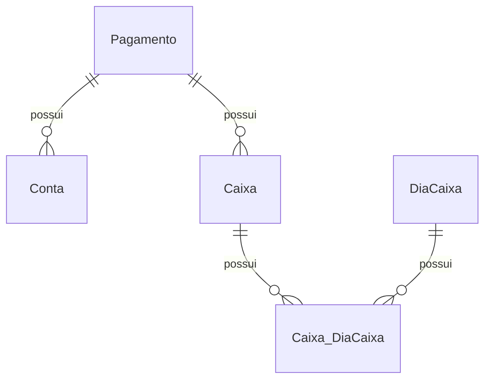

 # Documento de Modelos

Neste documento temos o modelo Conceitual (UML) ou de Dados (Entidade-Relacionamento). Temos também a descrição das entidades e o dicionário de dados.

Para a modelagem pode se usar o Astah UML ou o BrModelo. Uma ferramenta interessante para modelos UML é a [YUML](http://yuml.me), no link temos um exemplo de [Modelo UML com YUML](yuml/monitoria-yuml.md). Atualmente é possível usar a ferramenta **Mermaid** segundo o blog do GitHub [Include diagrams in your Markdown files with Mermaid](https://github.blog/2022-02-14-include-diagrams-markdown-files-mermaid/). A documentação do **Mermaid** pode ser encontrada em [Mermaid in GitHub](https://mermaid-js.github.io/mermaid).

## Modelo Conceitual

### Diagrama de Classes usando Mermaid

```mermaid
classDiagram
  class Pessoa {
    - nome: char
    - email: char
    - numTelefone: char
    - status: boolean
    - dataNascimento: char
    
    + setNome(value: char): void
    + setEmail(value: char): void
    + setNumTelefone(value: char): void
    + setStatus(value: boolean): void
    + getNome(): char
    + getEmail(): char
    + getNumTelefone(): char
    + getStatus(): boolean
    + incluirPessoa(pes: Pessoa): void
    + alterarPessoa(pes: Pessoa): void
    + desativarPessoa(pes: Pessoa): void
    + listarPessoa(pes: Pessoa): void
  }
  
  class Cliente {
    - cpf: char
    - rg: char
    
    + set(): void
    + get(): void
    + consultarCliente(cpf: char): Cliente
  }

    class Fornecedor {
    - cnpj: char
    
    + set(): void
    + get(): void
    + consultarFornecedor(cnpj: char): Fornecedor
  }
    class Funcionario {
    - cpf: char
    - cargo: char
    - salario: double
    - cargaHoraria: double
    
    + set(): void
    + get(): void
    + consultarFuncionario(cpf: char): Funcionario
    + selecionarCargo(cargo: char): void
    + calcularSalario(salario: double, cargaHoraria: double): double
  }
  
  class Endereco {
    - nome: char
    - numCasa: int
    - complemento: char
    
    + set(): void
    + get(): void
  }
  
  class Bairro {
    - nome: char
    - codigo: int
    - ownerCidade: Cidade
    
    + set(): void
    + get(): void
  }
  
  class Cidade {
    - cep: char
    - nome: int
    - codigo: int
    - ownerEstado: Estado
    
    + set(): void
    + get(): void
  }
  
  class Estado {
    - rua: int
    - codigo: int
    - ownerPessoa: Pessoa
    - ownerBairro: Bairro
    
    + set(): void
    + get(): void
  }

class Produto {
    - codigoBarras: char
    - tipo: char
    - dataValidade: char
    - quantMinima: int
    - valor : double
    - status: boolean
    - ownerPessoa: char
    
    + set(): void
    + get(): void
    + incluirProduto(prod: Produto) : void
    + consultarProduto(codigoBarras: char) : Produto
    + desativarProduto(prod: Produto) : void
    + alterarProduto(prod: Produto) : void
    + gerarRelatorioItensQuantMinima(quantMinima: int) : ArrayList
    + gerarRelatorioProdutosDisponiveis(status: boolean) : ArrayList
    + mudarStatus(status: boolean) : void
  }

  class Venda_Produto {
    - produto: Produto
    - venda: Venda
    - quantidade: int
    - valor: double
    
    + setProduto(produto: Produto): void
    + setVenda(venda: Venda): void
    + setQuantidade(quant: int): void
    + setValor(valor: double): void
    + getProduto(): Produto
    + getVenda(): Venda
    + getQuantidade(): int
    + getValor(): double
  }

  class Venda {
    - cliente: Pessoa
    - codigo: int
    - data: char
    - total: double
  
    + setCliente(cliente: Pessoa): void
    + setCodigo(codigo: int): void
    + setData(data: char): void
    + setMetodoPagamento(metodo_pagamento: char): void
    + getCliente(): Pessoa
    + getCodigo(): int
    + getData(): char
    + getMetodoPagamento(): char
    + registrarVenda(venda: Venda): void
    + consultarVenda(venda: Venda): void
    + calcularValor(venda: Venda): double
    + gerarNotaFiscal(venda: Venda): void
    + gerarConta(cliente: Pessoa, venda: Venda): void
    + gerarRelatorioVendasMensais(venda: Venda, data: char): ArrayList
  }

  class Venda_MetodoPagamento {
    - venda: Venda
    - metodoPagamento: MetodoPagamento
    - valor: double
  }

  class NotaFiscal {
    - DataEmissao: char
    - listVendaProduto: char
    - ownerVenda: char
    
    + set(): void
    + get(): void
    + valorTotal(valorBase: double, impostos: double, valorProduto: double): void
  }
  
  class EntradaMercadoria {
    - quantidade: int
    - codigo: int
    - fornecedor: Pessoa
    - data: char
    - valor: double
    
    + sets(): void
    + gets(): void
    + incluirEntrada(entrada: EntradaMercadoria): void
    - gerarConta(entrada: EntradaMercadoria, fornecedor: Pessoa): void
  }

  class EntradaMercadoria_Produto {
    - produto: Produto
    - entradaMercadoria: EntradaMercadoria
  }

  class EntradaMercadoria_MetodoPagamento {
    - ownerEntradaMercadoria: EntradaMercadoria
    - ownerMetodoPagamento: MetodoPagamento
  }

  class MetodoPagamento {
    - codigo: int
    - descricao: char
  
    + setCodigo(codigo: int): void
    + setDescricao(descricao: char): void
    + getCodigo(): int
    + getDescricao(): char
  }
  
  class Conta {
    - codigo: int
    - venda: Venda
    - valor: double
    - dataVencimento: char
    - tipoReceber: boolean
    - entradaMercadoria: EntradaMercadoria
    
    + sets(): void
    + gets(): void
    + incluirConta(conta: Conta): void
    + alterarConta(conta: Conta): void
    + consultarConta(cod: int): Conta
    + tipoConta(conta: Conta): void
    + gerarRelatorioLucrosMensais(conta: boolean): ArrayList
    + gerarRelatorioDespesasMensais(conta: boolean): ArrayList
  }

  class Caixa {
    - dataHoraAberturaAtual: char
    - idCaixa: int
    - valorInicial: double
    - valorAtual: double
    - isOpen: boolean
  
    + setDataHoraAberturaAtual(value: char): void
    + setIdCaixa(value: int): void
    + setValorInicial(value: double): void
    + setValorAtual(value: double): void
    + setIsOpen(value: boolean): void
    + getDataHoraAbertura(): char
    + getIdCaixa(): int
    + getValorInicial(): double
    + getValorAtual(): double
    + getIsOpen(): boolean
    + entrada(valor: double): void
    + saida(valor: double): void
  }

  class Caixa_DiaCaixa {
    - ownerCaixa: Caixa
    - ownerDiaCaixa: DiaCaixa
  }

  class DiaCaixa {
    - dataHoraAbertura: char
    - dataHoraEncerramento: char
    - valorInicial: double
    - valorFinal: double

    + setDataHoraAbertura(value: char): void
    + setDataHoraEncerramento(value: char): void
    + setValorInicial(value: double): void
    + setValorFinal(value: double): void
    + getDataHoraAbertura(): char
    + getDataHoraEncerramento(): char
    + getValorInicial(): double
    + getValorFinal(): double
  }
  
  class Pagamento {
    - conta: Conta
    - caixa: Caixa
    - valor: double
    - data: char
  
    + setConta(value: Conta): void
    + setCaixa(value: Caixa): void
    + setValor(value: double): void
    + setData(value: char): void
    + getConta(): Conta
    + getCaixa(): Caixa
    + getValor(): double
    + getData(): char
    + incluirConta(conta: Conta): void
    + alterarConta(conta: Conta): void
    + consultarConta(cod: int): Conta
    + tipoConta(conta: Conta): void
    + gerarRelatorioLucrosMensais(conta: boolean): ArrayList
    + gerarRelatorioDespesasMensais(conta: boolean): ArrayList
  }
  
  

Pessoa "*" -- "1" Endereco : possui
Pessoa "1" -- "*" Venda : possui
Venda "1" -- "1" Conta : possui
Venda "1" -- "1" NotaFiscal : possui
Venda "1" -- "*" Venda_MetodoPagamento : possui
Venda "1" -- "*" Venda_Produto : possui
Venda_MetodoPagamento "*" -- "1" MetodoPagamento : possui
NotaFiscal "1" -- "*" Venda_Produto : possui
Pessoa <|-- Cliente
Endereco "*" -- "1" Bairro : possui
Bairro "*" -- "1" Cidade : possui
Cidade "*" -- "1" Estado : possui
Conta "1" -- "1" EntradaMercadoria : possui
EntradaMercadoria "1" -- "*" EntradaMercadoria_Produto : possui
Pagamento "*" -- "1" Conta : possui
Pagamento "*" -- "1" Caixa : possui
Pessoa <|-- Fornecedor
Pessoa <|-- Funcionario
Produto "1" -- "*" Venda_Produto : possui
Produto "1" -- "*" EntradaMercadoria_Produto : possui
Caixa "1" -- "*" Caixa_DiaCaixa : possui
DiaCaixa "1" -- "*" Caixa_DiaCaixa : possui
EntradaMercadoria "1" -- "*" EntradaMercadoria_MetodoPagamento : possui
MetodoPagamento "1" -- "*" EntradaMercadoria_MetodoPagamento : possui


```

### Descrição das Entidades

Descrição sucinta das entidades presentes no sistema.

| Entidade | Descrição   |
|----------|------------------------------------------------------------------------------------------------------------------------------------------------------|
| Pagamento | Entidade que representa um Pagamento tem as informações: conta, caixa, valor, data, +set's(), +get's(), +incluirConta(), +alterarConta(), +consultarConta(), +tipoConta(), +gerarRelatorioLucrosMensais() +gerarRelatorioDespesasMensais. |
| Caixa | Entidade que representa um Caixa tem as informações: dataHoraAberturaAtual, idCaixa, valorInicial, valorAtual, isOpen, +set's(), +get's(), +entrada(), +saida() |
| Caixa_DiaCaixa | Entidade que representa um Caixa_DiaCaixa tem as informações: ownerCaixa, ownerDiaCaixa |
| DiaCaixa | Entidade que representa um DiaCaixa tem as informações: dataHoraAbertura, dataHoraEncerramento, valorInicial, valorFinal, +set's(), +get's() |
| Bairro | Entidade que representa um Bairro e tem as informações: nome, código, ownerCidade, +set's() e +get's() |
| NotaFiscal | Entidade que representa uma NotaFiscal no sistema, e tem as seguintes informações: dataEmissao, listVendaProduto, ownerVenda, +set's(), +get's() e +valorTotal() |
| Venda | Entidade que representa uma Venda no sistema, e tem as seguintes informações: cliente, código, data, total, +set's(), +get's(), +registrarVenda(), +consultarVenda(), +calcularValor(), +gerarNotaFiscal(), +gerarConta() e +gerarRelatorioVendasMensais() |
| Venda_Produto | Entidade que representa a Venda_Produto e tem como informações: produto, venda, quantidade, valor, +set's() e +get's() |
| Venda_MetodoPagamento | Entidade que representa o método de pagamento da venda e tem as informações: venda, metodoPagamento e valor |
| MetodoPagamento | Entidade que representa o MetodoPagamento e tem as seguintes informações: codigo, descricao, +set's() e +get's() |

## Modelo de Dados (Entidade-Relacionamento)

Para criar modelos ER é possível usar o BrModelo e gerar uma imagem. Contudo, atualmente é possível criar modelos ER usando a ferramenta **Mermaid**, escrevendo o modelo diretamente em markdown. Acesse a documentação para escrever modelos [ER Diagram Mermaid](https://mermaid-js.github.io/mermaid/#/entityRelationshipDiagram).

### Dicionário de Dados

* Conta

| Tabela     | Conta                                                                      |
| ---------- | -------------------------------------------------------------------------- |
| Descrição  | Armazena as informações de uma conta                     .                 |
| Observação | A conta poderá ser a pagar (Entrada) ou a receber (Venda)                  |

| Nome          | Descrição                        | Tipo de Dado | Tamanho | Restrições de Domínio |
| ------------- | -------------------------------- | ------------ | ------- | --------------------- |
| codigo             | Identificador gerado automatico   | INT          | ---     | PK / Identity    |
| venda              | Identificador da venda realizada  | Venda      | ---     | FK         |
| valor              | Valor referente a conta           | DOUBLE     | ---     | Not Null      |
| dataVencimento     | Data de vencimento da conta       | CHAR       | 55      | Not Null      |
| tipoReceber        | Campo identificador para saber se é entrada ou saída      | BOOLEAN      | ---     | Not Null    |
| entradaMercadoria  | Identificador da entradaMercadoria realizada    | EntradaMercadoria      | ---      | FK       |

* Pagamento

| Tabela     | Pagamento                                                                      |
| ---------- | -------------------------------------------------------------------------- |
| Descrição  | Armazena as informações de um Pagamento                     .                 |
| Observação | O usuário poderá concretizar o pagamento de uma conta em determinado caixa    |

| Nome          | Descrição                        | Tipo de Dado | Tamanho | Restrições de Domínio |
| ------------- | -------------------------------- | ------------ | ------- | --------------------- |
| codigo             | Identificador gerado automatico   | INT          | ---     | PK / Identity    |
| conta              | Identificador da conta a ser paga  | Conta      | ---     | FK / Not Null     |
| valor              | Valor referente ao pagamento           | DOUBLE     | ---     | Not Null      |
| data              | Data referente ao pagamento da conta    | CHAR     | 55     | Not Null         |
| caixa  | Identificador do caixa que será pago a conta  | Caixa      | ---      | FK / Not Null     |

* Caixa

| Tabela     | Caixa                                                                      |
| ---------- | -------------------------------------------------------------------------- |
| Descrição  | Armazena as informações de um Caixa                     .                 |
| Observação | O usuário autorizado poderá abrir e fechar o caixa, além de administrar a entrada e saída de dinheiro    |

| Nome          | Descrição                        | Tipo de Dado | Tamanho | Restrições de Domínio |
| ------------- | -------------------------------- | ------------ | ------- | --------------------- |
| codigo                  | Identificador gerado automatico   | INT          | ---     | PK / Identity    |
| valorInicial            | Valor inicial que o caixa começou a operar em determinado dia | DOUBLE | --- | Not Null |
| valorAtual              | Valor atual em que o caixa se encontra em determinado dia     | DOUBLE | --- | Not Null |
| dataHoraAberturaAtual   | Data referente ao dia e hora que o caixa foi aberto em certo dia | CHAR | 55 | Not Null |
| isOpen                  | Atributo para identificar se o caixa está aberto ou fechado  | BOOLEAN  | ---   | Not Null  |

* Caixa_DiaCaixa

| Tabela     | Caixa_DiaCaixa                                                                      |
| ---------- | -------------------------------------------------------------------------- |
| Descrição  | Armazena as informações de um Caixa_DiaCaixa                     .                   |
| Observação | Ao fechar o caixa será gerado uma tabela com o histórico do mesmo no dia em questão  |

| Nome          | Descrição                        | Tipo de Dado | Tamanho | Restrições de Domínio |
| ------------- | -------------------------------- | ------------ | ------- | --------------------- |
| codigo        | Identificador gerado automatico   | INT          | ---     | PK / Identity    |
| ownerCaixa    | Identificador do caixa que será gerado o histórico em um dia específico | Caixa | --- | FK / Not Null |
| ownerDiaCaixa | Identificador do DiaCaixa que será atribuído a um caixa em um dia específico | DiaCaixa | --- |FK / Not Null |

* DiaCaixa

| Tabela     | DiaCaixa                                                                      |
| ---------- | -------------------------------------------------------------------------- |
| Descrição  | Armazena as informações de um DiaCaixa                     .                   |
| Observação | Essa tabela será gerada após o fechamento de um caixa onde será armazenadas as informações do mesmo no dia do fechamento   |

| Nome          | Descrição                        | Tipo de Dado | Tamanho | Restrições de Domínio |
| ------------- | -------------------------------- | ------------ | ------- | --------------------- |
| codigo        | Identificador gerado automatico   | INT          | ---     | PK / Identity    |
| dataHoraAbertura     | Data e hora em que o caixa foi aberto em um dia específico | CHAR | 55 | Not Null |
| dataHoraEncerramento | Data e hora em que o caixa foi fechado em um dia específico | CHAR | 55 | Not Null |
| valorInicial    | Valor em que o caixa começou a operar em um dia específico | DOUBLE | --- | Not Null |
| valorFinal      | Valor em que o caixa terminou de operar em um dia específico | DOUBLE | --- | Not Null |
